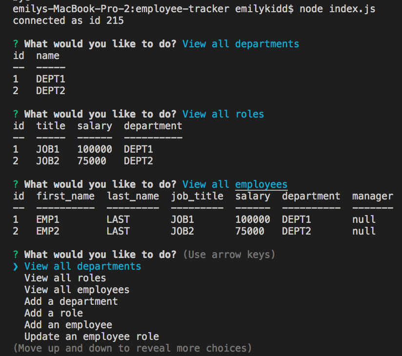

# employee-tracker

### Description
This node based command line application allows users to navigate through and populate tables to view and manage departments, roles, and employees for a company. 

### Download Instructions
Clone the respository onto your machine, and run 'npm init', and 'npm i' in your command line. To create the database and tables, open Mysql using 'mysql -u root -p', then 'source db/schema.sql;'. Use 'quit;' to exit mysql, and 'node index.js' to start the application.

### Built With
* JavaScript
* Node
* ES6
* Inquirer
* Mysql

### Video Walk Through
[link](https://drive.google.com/file/d/1Ah_R_tTZ_fwrw-inFXHeM7Oe5dMHTcZ2/view)

### Screenshot

### Contribution
Made by Emily Kidd

### Contact
[GitHub](github.com/emilykidd3)  
[Email](mailto:e.kidd61@yahoo.com)